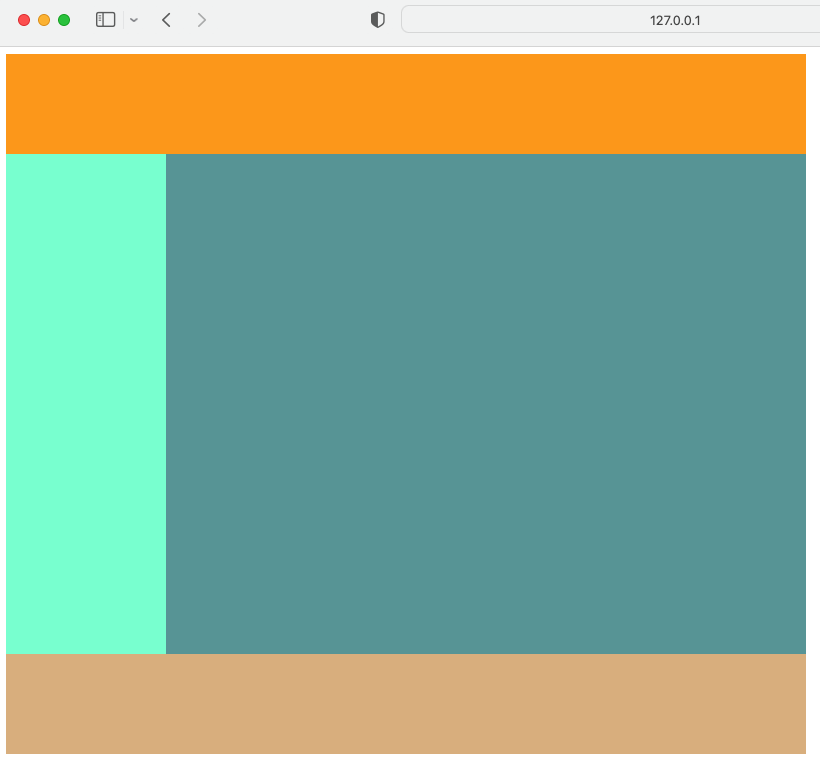
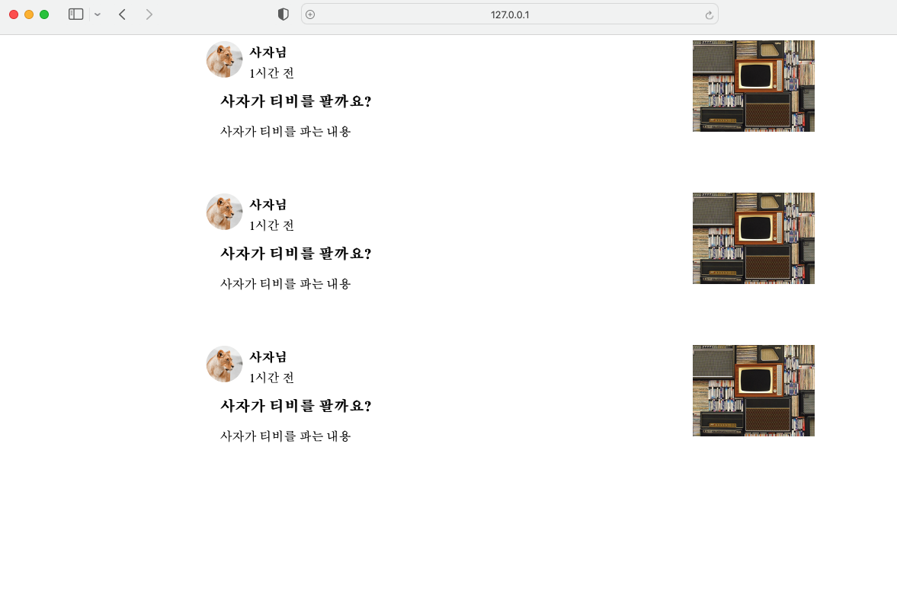
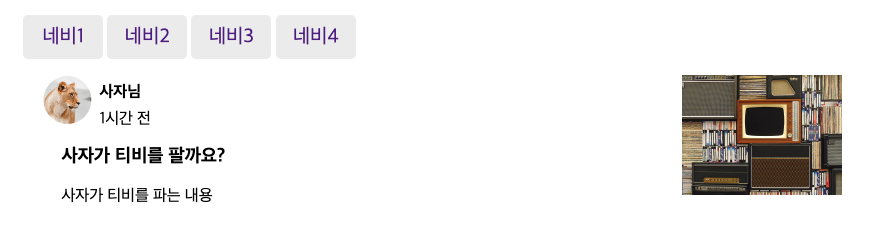
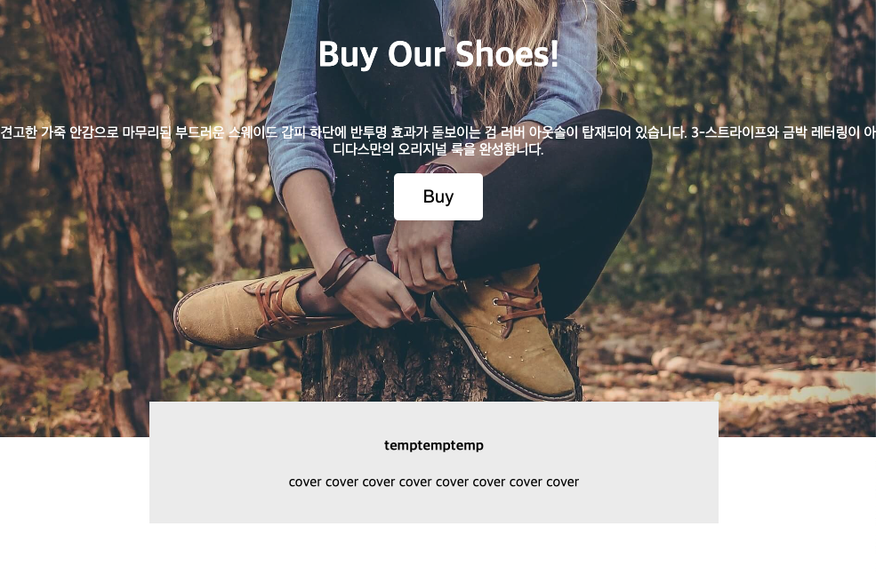
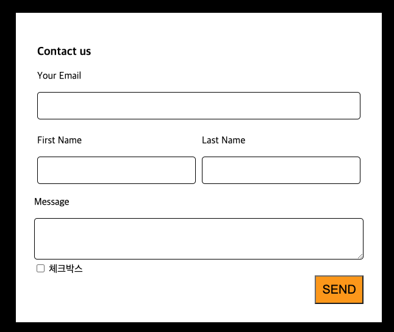
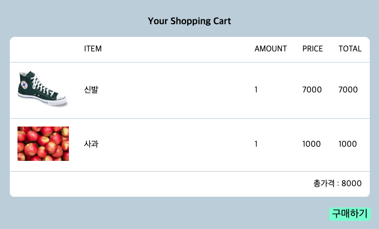
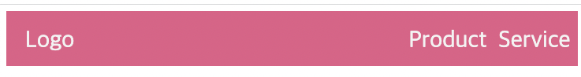

# WebStudy

## 1. layout

float속성을 이용한 레이아웃 기본 연습

## 2. blogList

사진크기 조절 및 div배치 조절 연습.

## 3. navbar

navbar 만들기 및 css 셀렉터 연습

## 4. position

position 속성 이용. 회색 박스 곂치기

## 5. form 태그 연습

## 6. table 태그 연습

## 6. flex이용한 레이아웃 디자인연습

